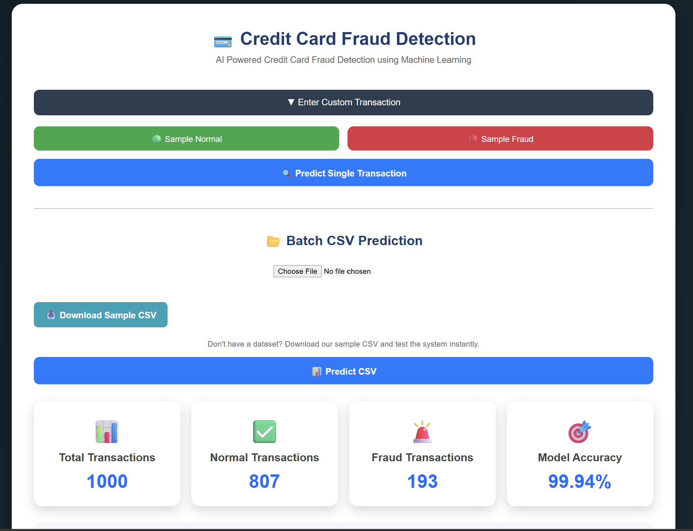
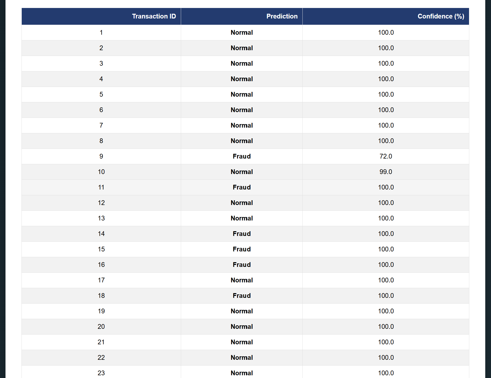
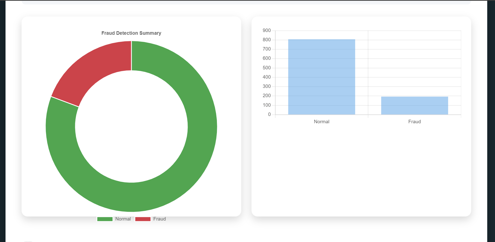
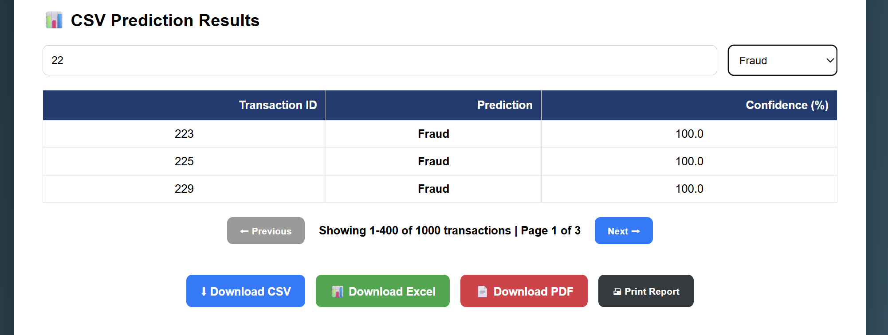
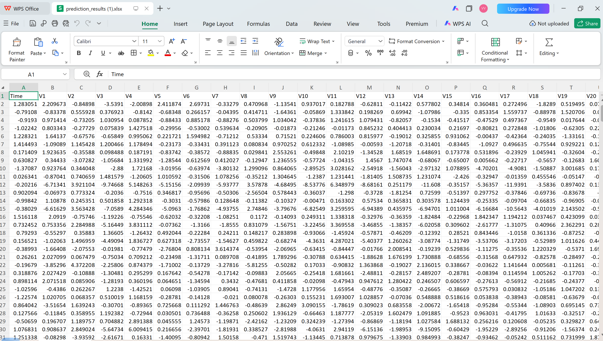

# 💳 Credit Card Fraud Detection using Machine Learning

<p align="center">
  
  
  
  
</p>

<p align="center">
Detect fraudulent credit card transactions using a Machine Learning model integrated into a Flask web application.
</p>

---

# 🚀 Live Demo

🌐 **Try the application here**

**https://creditcardfrauddetection-vsu1.onrender.com**

---

# 📌 Overview

This project detects fraudulent credit card transactions using a trained **Random Forest Classifier**.

Users can:

- Predict a single transaction
- Upload CSV files for batch prediction
- Download prediction reports in PDF and Excel
- View fraud statistics and charts
- Search, filter and paginate prediction results

The application is built using **Flask**, **Scikit-learn**, **Pandas**, and **Chart.js**.

---

# ✨ Features

- ✅ Machine Learning Fraud Detection
- ✅ Batch CSV Prediction
- ✅ Sample CSV Download
- ✅ Confidence Score
- ✅ Prediction Time
- ✅ Fraud Dashboard
- ✅ Interactive Charts
- ✅ Search Functionality
- ✅ Filter Predictions
- ✅ Pagination
- ✅ PDF Report Download
- ✅ Excel Report Download
- ✅ Responsive UI

---

# 🛠 Tech Stack

| Technology | Purpose |
|------------|----------|
| Python | Programming Language |
| Flask | Backend Framework |
| Scikit-learn | Machine Learning |
| Pandas | Data Processing |
| NumPy | Numerical Computing |
| Joblib | Model Serialization |
| OpenPyXL | Excel Report Generation |
| ReportLab | PDF Report Generation |
| HTML | Frontend |
| CSS | Styling |
| JavaScript | Client-side Features |
| Chart.js | Data Visualization |

---

# 📂 Project Structure

```text
CreditCardFraudDetection/
│
├── models/
│   ├── fraud_detection_model.pkl
│   └── scaler.pkl
│
├── notebooks/
│   └── fraud_detection.ipynb
│
├── sample_data/
│   └── sample_transactions.csv
│
├── screenshots/
│
├── static/
│   ├── style.css
│   └── script.js
│
├── templates/
│   └── index.html
│
├── app.py
├── Procfile
├── runtime.txt
├── requirements.txt
├── README.md
└── .gitignore
```

---

# 📸 Screenshots

## Home Page


---

## Dashboard



---

## Prediction Results



---

## Charts



---

## Search & Filter



---

## Reports



---

# ⚙ Installation

Clone the repository

```bash
git clone https://github.com/VijayKumar-Kareti/CreditCardFraudDetection.git
```

Go to project directory

```bash
cd CreditCardFraudDetection
```

Create virtual environment

```bash
python -m venv venv
```

Activate virtual environment

### Windows

```bash
venv\Scripts\activate
```

### Linux / macOS

```bash
source venv/bin/activate
```

Install dependencies

```bash
pip install -r requirements.txt
```

Run the application

```bash
python app.py
```

---

# 📊 Machine Learning Model

Algorithm Used:

- Random Forest Classifier

Model Workflow:

- Data Cleaning
- Feature Scaling
- Model Training
- Prediction
- Evaluation

---

# 📁 Dataset

The project uses the **Credit Card Fraud Detection Dataset**.

> Due to GitHub file size limits, the original dataset is not included in this repository.

A sample CSV file is provided inside:

```text
sample_data/sample_transactions.csv
```

---

# 📈 Model Performance

| Metric | Value |
|---------|--------|
| Accuracy | **99.94%** |
| Algorithm | Random Forest |
| Dataset | Credit Card Fraud Detection |

---

# 🔮 Future Enhancements

- User Authentication
- REST API
- Real-time Fraud Detection
- Deep Learning Models
- Email Notifications
- Cloud Database Integration

---

# 👨‍💻 Developer

**Venkata Vijay Kumar Kareti**

GitHub:

https://github.com/VijayKumar-Kareti

---

# ⭐ Support

If you found this project useful,

⭐ **Star this repository**

---

## Thank You ❤️
